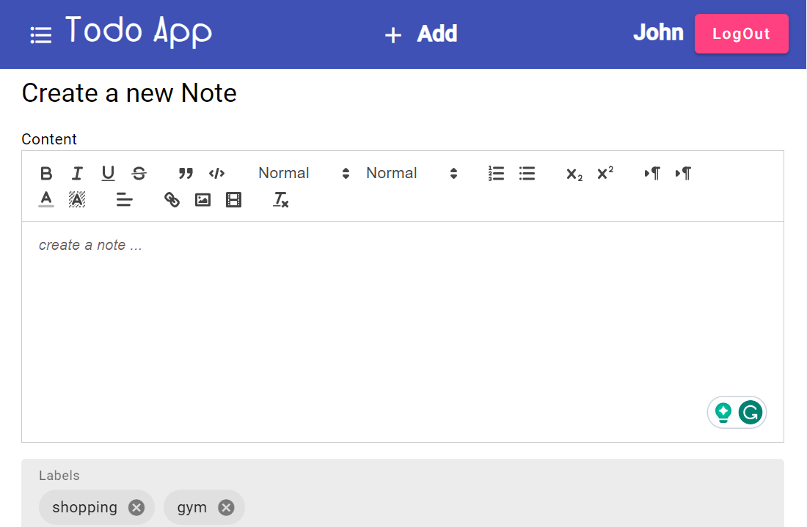
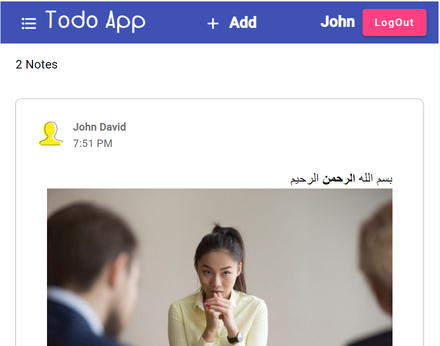
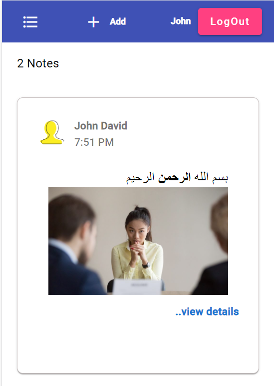

# todo Ap

## Teleologies used

- NodeJs
- Angular v17
- NestJs
- Fastify (for the API server) and Express for SSR
- TypeORM
- MongoDb / postgreSQL (both are supported)
- Swagger (for API documenting)
- jest (for unit testing)
- PWA (progressive web app)
- material design
- CI/CD with github actions
- Server-side rendering
- Quill

## features

- front-end and backend
- Authentication
- SEO friendly (meta tags are updated for each route)
- responsive design and mobile-first UX
- an advanced editor
- search todo notes by labels

## screenshots

**editor:**

<br />

**wide screens:**

<br />

**small screens:**



## getting started

1- clone the repo and install the dependencies

```
npm i -f
```

2- create the database according to .env.development
3- run both the backend and the frontend apps, in separate terminals

```
cd apps/todo-backend && npm start
cd apps/todo-ui && npm start
```

4- navigate to http://localhost:4200 and http://localhost:3000 for API playground

5- register a new user via POST `/auth/register` and authorize the swagger UI

> tip: you can do so by just copying the auth_token value into the "Authorize" button of the swagger UI

## testing

- for unit testing run `npm t` from the project's root
- for API testing start the app and navigate to http://localhost:3000

  _testing is still in progress_

## API quick reference

navigate to http://localhost:3000 to test the API endpoints

- `POST /auth/register` and `POST /auth/login` for Authorization
- creating a todo note: `POST /todo`
- list the current logged-in user's notes: `GET /todo/me`
- list all notes: `GET /todo`

for the full list of API endpoints, navigate to http://localhost:3000
